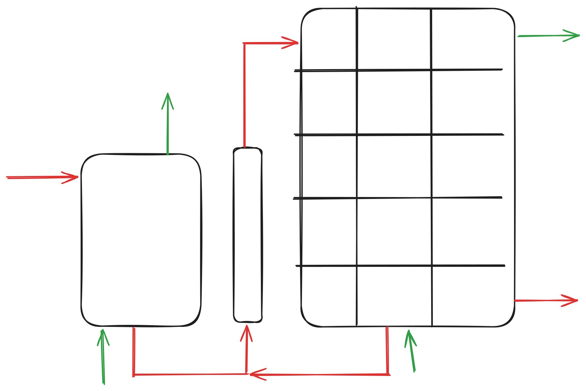

# Modeler

**CMTool** has been designed to allow to reuse and assemble different compartment model. THis is either be to model from stach scale-down experiments or assemble CFD-based compartment model. The philosophy is to designed reactors with input/output position and flow for gas and liquid, assemble as desired in any direction.

## Building Flowmaps with XML

To assemble flowmaps almost seamlessly, compartment models are defined using an **XML file**.

Each XML file must contain the following core elements:

| Tag | Description |
|:----|:------------|
| **Reactors** | Defines individual reactor units. Different tags exist for **0D**, **1D**, **2D**, or pre-existing (**CFD-based**) reactors. |
| **Connections** | Specifies **intra-flowmap**, connections between reactors (liquid and/or gas phases).|
| **Feeds** | Defines input flows entering the domain from outside (liquid and/or gas) |

More details [here](./tuto/basic_xml.md)
